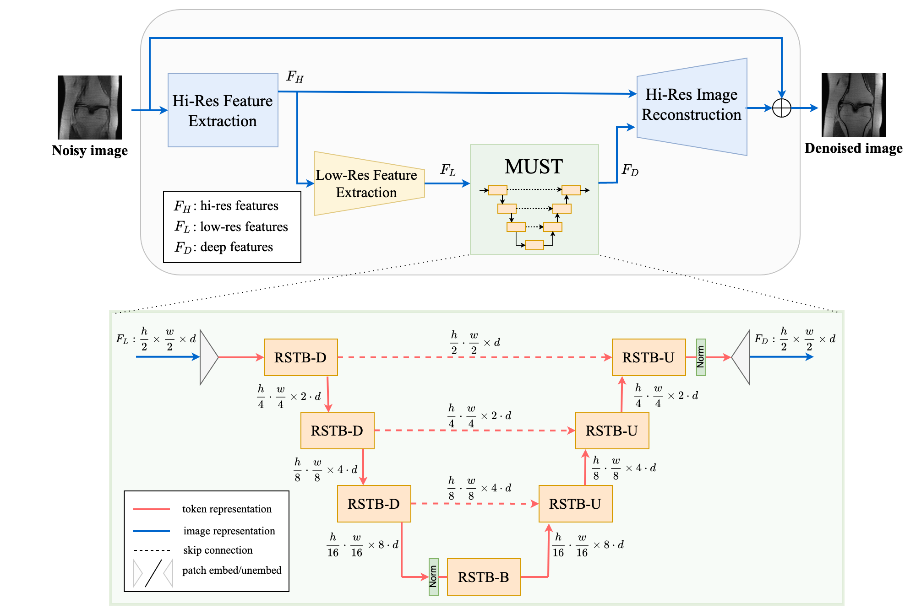

# HUMUS-Net
This is the PyTorch implementation of HUMUS-Net, a Transformer-convolutional **H**ybrid **U**nrolled **Mu**lti-**S**cale **Net**work architecture for accelerated MRI reconstruction.



Reproducible results on the fastMRI multi-coil knee test dataset with x8 acceleration:

| Method      | SSIM | NMSE | PSNR |
| ------------ | ---------- | ------------ | -------------- |
| **HUMUS-Net (ours)** | **0.8945**      | **0.0081**           | **37.3**           |
| [E2E-VarNet](https://github.com/facebookresearch/fastMRI/tree/main/fastmri_examples/varnet) | 0.8920      | 0.0085           | 37.1           |
| [XPDNet](https://github.com/zaccharieramzi/fastmri-reproducible-benchmark) | 0.8893      | 0.0083           | 37.2           |
| [Sigma-Net](https://github.com/khammernik/sigmanet) | 0.8877      | 0.0091           | 36.7           |
| [i-RIM](https://github.com/pputzky/irim_fastMRI) | 0.8875      | 0.0091           | 36.7           |

*Pre-trained HUMUS-Net models for the [fastMRI Public Leaderboard](https://fastmri.org/leaderboards) submissions can be found below.*

This repository contains code to train and evaluate HUMUS-Net model on the [fastMRI](https://fastmri.med.nyu.edu/) knee, [Stanford 2D FSE](http://mridata.org/list?project=Stanford%202D%20FSE) and [Stanford Fullysampled 3D FSE Knees](http://mridata.org/list?project=Stanford%20Fullysampled%203D%20FSE%20Knees) datasets.


## Requirements
CUDA-enabled GPU is necessary to run the code. We tested this code using:
- Ubuntu 18.04
- CUDA 11.4
- Python 3.8.5

## Installation
To install the necessary packages, create a new virtual environment and run
```bash
git clone https://github.com/z-fabian/HUMUS-Net
cd HUMUS-Net
pip3 install -r requirements.txt
```

## Datasets
### fastMRI
FastMRI is an open dataset, however you need to apply for access at https://fastmri.med.nyu.edu/. To run the experiments from our paper, you need the download the fastMRI knee dataset with the
following files:
- knee_singlecoil_train.tar.gz
- knee_singlecoil_val.tar.gz
- knee_multicoil_train.tar.gz
- knee_multicoil_val.tar.gz

After downloading these files, extract them into the same directory. Make sure that the directory contains exactly the following folders:
- singlecoil_train
- singlecoil_val
- multicoil_train
- multicoil_val

### Stanford datasets
Please follow [these instructions](data/stanford/README.md) to batch-download the Stanford datasets.
Alternatively, they can be downloaded from http://mridata.org volume-by-volume at the following links:
- [Stanford 2D FSE](http://mridata.org/list?project=Stanford%202D%20FSE)
- [Stanford Fullysampled 3D FSE Knees](http://mridata.org/list?project=Stanford%20Fullysampled%203D%20FSE%20Knees)

After downloading the .h5 files the dataset has to be converted to a format compatible with fastMRI modules. To create the datasets used in the paper please follow the instructions [here](data/stanford/README.md).

## Training
### fastMRI knee
To train HUMUS-Net on the fastMRI knee dataset, run the following in the terminal:
```bash
python3 humus_examples/train_humus_fastmri.py \
--config_file PATH_TO_CONFIG \
--data_path DATA_ROOT \
--default_root_dir LOG_DIR \
--gpus NUM_GPUS
```

- `PATH_TO_CONFIG`: path do the `.yaml` config file containing the experimental setup and training hyperparameters. Config files can be found in the `humus_examples/experiments` folder. Alternatively, you can create your own config file, or directly pass all arguments in the command above.
- `DATA_ROOT`: root directory containing fastMRI data (with folders such as `multicoil_train` and `multicoil_val`)
- `LOG_DIR`: directory to save the log files and model checkpoints. Tensorboard is used as default logger.
- `NUM_GPUS`: number of GPUs used in DDP training assuming single-node multi-GPU training.

### Stanford datasets
Similarly, to train on either of the Stanford datasets, run
```bash
python3 humus_examples/train_humus_stanford.py \
--config_file PATH_TO_CONFIG \
--data_path DATA_ROOT \
--default_root_dir LOG_DIR \
--train_val_seed SEED \
--gpus NUM_GPUS
```
In this case `DATA_ROOT` should point directly to the folder containing the *converted* `.h5` files. `SEED` is used to generate the training-validation split (`0`, `1`, `2` in our experiments).

**Note**: Each GPU is assigned whole volumes of MRI data for validation. Therefore the number of GPUs used for training/evaluation cannot be larger than the number of MRI volumes in the validation dataset. We recommend using 4 or less GPUs when training on the Stanford 3D FSE dataset.

## Pre-trained models
Here you can find checkpoint files for the models submitted to the fastMRI Public Leaderboard. See the next section how to load/evaluate models from the checkpoint files.

| Dataset      | Trained on | Acceleration | Checkpoint size|   Link   |
| ------------ | ---------- | ------------ | -------------- | -------- |
| fastMRI Knee | train      | x8           | 1.4G           | [Download](https://drive.google.com/file/d/1xS4hPi-ssYWi7yt7t_dj96qtlaGBnw5M/view?usp=sharing) |
| fastMRI Knee | train+val  | x8           | 1.4G           | [Download](https://drive.google.com/file/d/14r23_yrpB3f_Jq9eOYcd_X9-dXk6Dpk3/view?usp=sharing) |

## Evaluating models
### fastMRI knee
To evaluate a model trained on fastMRI knee data on the validation dataset, run
```bash
python3 humus_examples/eval_humus_fastmri.py \
--checkpoint_file CHECKPOINT \
--data_path DATA_DIR \
--gpus NUM_GPUS \
```
- `CHECKPOINT`: path to the model checkpoint `.ckpt` file

**Note**: by default, the model will be evaluated on 8x acceleration.

### Stanford datasets
To evaluate on one of the Stanford datasets run
```bash
python3 humus_examples/eval_humus_stanford.py \
--checkpoint_file CHECKPOINT \
--data_path DATA_DIR \
--gpus NUM_GPUS \
--train_val_split TV_SPLIT \
--train_val_seed TV_SEED
```
- `TV_SPLIT`: portion of dataset to be used as training data, rest is used for validation. For example if set to `0.8` (default), then 20% of data will be used for evaluation now.
- `TV_SEED`: seed used to generate the train-val split.

## Custom training
To experiment with different network settings see all available training options by running
```bash
python3 humus_examples/train_humus_fastmri.py --help
```
Alternatively, the `.yaml` files in `humus_examples/experiments` can be customized and used as config files as described before.

## License
HUMUS-Net is MIT licensed, as seen in the [LICENSE](LICENSE) file.

## Citation
Coming soon.

## Acknowledgments and references
- [fastMRI repository]( https://github.com/facebookresearch/fastMRI)
- **fastMRI**: Zbontar et al., *fastMRI: An Open Dataset and Benchmarks for Accelerated MRI, https://arxiv.org/abs/1811.08839*
- **Stanford 2D FSE**: Joseph Y. Cheng, https://github.com/MRSRL/mridata-recon/
- **Stanford Fullysampled 3D FSE Knees**: Epperson K, Sawyer AM, Lustig M, Alley M, Uecker M., *Creation Of Fully Sampled MR Data Repository For Compressed Sensing Of The Knee. In: Proceedings of the 22nd Annual Meeting for Section for Magnetic Resonance Technologists, 2013*
